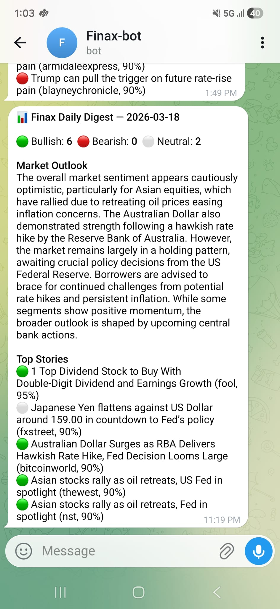

# finax

Autonomous multi-agent financial intelligence system for real-time market monitoring and sentiment analysis.

Finax fetches financial news, runs LLM-powered sentiment analysis via Google Gemini, and delivers daily digests to Telegram and email on a configurable schedule.



## Features

- **Scout Agent** — Fetches and deduplicates financial news from NewsData.io for configured tickers and keywords
- **Analyst Agent** — Scores each article (bullish / bearish / neutral) with confidence and reasoning using Gemini 2.5 Flash
- **Alert Agent** — Delivers formatted digests via Telegram (MarkdownV2) and email (HTML + plain text)
- **Scheduler** — APScheduler daemon with cron trigger; defaults to 06:00 SGT daily

## Quick Start

```bash
# 1. Clone and install
git clone https://github.com/JC-Prog/finax.git
cd finax
uv sync

# 2. Configure environment
cp .env.example .env
# Fill in API keys and SMTP credentials in .env

# 3. Run the scheduler daemon
uv run finax

# Or run the pipeline once immediately and exit
uv run finax --run-now
```

## Configuration

Copy `.env.example` to `.env` and set the following variables:

| Variable | Description |
|---|---|
| `GOOGLE_API_KEY` | Google AI Studio key (Gemini) |
| `NEWSDATA_API_KEY` | NewsData.io API key |
| `TELEGRAM_BOT_TOKEN` | Bot token from @BotFather |
| `TELEGRAM_CHAT_ID` | Target chat/user ID |
| `SMTP_HOST` / `SMTP_PORT` | SMTP server (default: Gmail) |
| `SMTP_USER` / `SMTP_PASSWORD` | SMTP credentials |
| `EMAIL_FROM` / `EMAIL_TO` | Sender and recipients (comma-separated) |
| `WATCH_TICKERS` | Comma-separated tickers (e.g. `AAPL,TSLA,NVDA`) |
| `WATCH_KEYWORDS` | Comma-separated keywords (e.g. `earnings,fed`) |
| `SCHEDULE_HOUR` | Hour to run (default: `6`) |
| `SCHEDULE_MINUTE` | Minute to run (default: `0`) |
| `SCHEDULE_TIMEZONE` | Timezone (default: `Asia/Singapore`) |
| `LOG_DIR` | Directory for log files (default: `logs/`) |

## Architecture

```
Scout → Analyst → Alert → END
```

The pipeline is orchestrated with [LangGraph](https://github.com/langchain-ai/langgraph). Each node is a conditional edge — downstream nodes only run if the previous node produced output.

## Development

```bash
uv sync --group dev
uv run ruff check src/
uv run ruff format src/
uv run pytest
```

## Documentation

Full documentation is available in [`docs/`](docs/) and can be served locally:

```bash
uv run mkdocs serve
```

## License

MIT — see [LICENSE](LICENSE).
